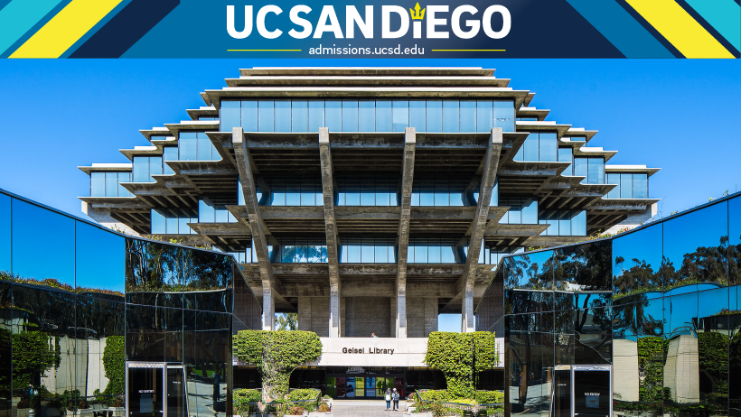

# Ron Siu
HELLO there, I am Ron and thanks for stopping by. :smile: :smile: :smile:

*Favorite verse*
>“My grace is sufficient for you, for my power is made perfect in weakness.” 
<br/>

[2-Corinthians-12:9](https://www.biblegateway.com/passage/?search=2%20Corinthians%2012%3A9&version=NIV)

<br/>

- [Edcation](#education)

- [Favorite_Code](#my-favorite-code)

- [Things_I_like](#things-i-like)
  
- [Showcase](#markdown-showcase)

## Education
I am working on my bachelor degree in **Computer Science** :computer: 
at University of California, San Diego ([UCSD](https://ucsd.edu/)). 
I really enjoy the beach nearby UCSD. 
<br/>



### My Favorite Code
```
git add .
git commit -m"new commit"
git push
```

##### Things I like 
- Learning different programming languages beside my study
- Traveling  :airplane:
- **FOOD** :rice: :curry: :bento: :yum: ~~Eat a lot~~
  1. Sushi :sushi:
  2. [Egg Fried Rice](https://www.youtube.com/watch?v=FrUfwpaNNIM) 

-[Hello_World](./HelloWorld.md)
  -[campus](./images/campus-timeline.jpg)

# MarkDown Showcase
<hr/>

# Biggest heading
## second
##### smallest

**bold**

*Italic*

~~abnormal~~

**see saw seen _cool_**

***It's Fantastic***

> quoting things
<br/>

Saying hello world in Python by `print`
```
print("Hello World!!!")
```
[Python Tutorial](https://www.w3schools.com/python/default.asp)

[More Hello World](./HelloWorld.md)

[Top](#ron-siu)

Courses I like most in UCSD
- CSE 100
- CSE 110
<br/>


1. Take Good notes
2. Get some sleep
3. Eat something great
4. Drink more water
5. Finishing list item
     - First nested list item
       - Second nested list item
         - COOL!!!

- [x] Familiarizing with Git
- [x] Using Markdown
- [x] Push my commits to GitHub

Let's go to [UCSD](https://ucsd.edu/). 


[Goto the Top](#ron-siu)
